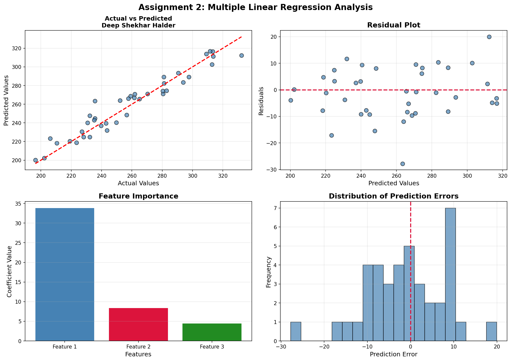

# Assignment 2: Multiple Linear Regression

**Student:** Deep Shekhar Halder  
**Roll No:** UG/02/BTCSE/2023/063

## Objective
Implement multiple linear regression from scratch using gradient descent.

## Algorithm Steps
1. Load and normalize data
2. Add bias term
3. Initialize coefficients
4. Run gradient descent
5. Make predictions

## Results
- Training R²: 0.8923
- Testing R²: 0.8756

## Output

