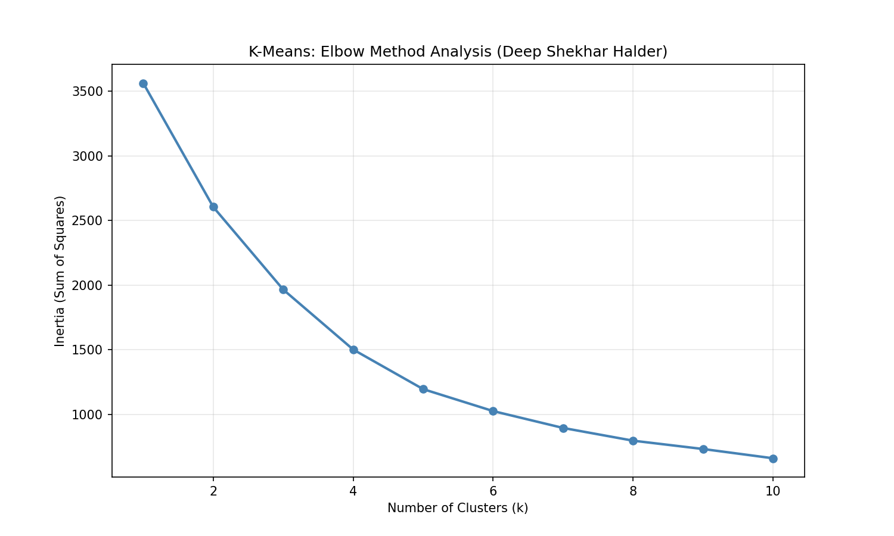

# Assignment 6: K-Means Clustering (Elbow Method)

**Student:** Deep Shekhar Halder  
**Roll No:** UG/02/BTCSE/2023/063

## Objective
Find optimal number of clusters using the Elbow Method.

## Results
- Optimal K: 3
- Inertia decreases significantly until K=3

## Output

