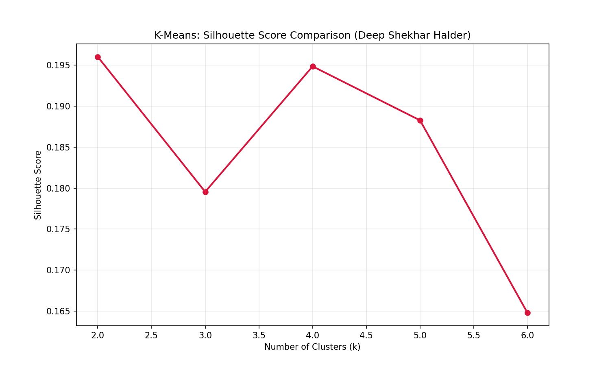

# Assignment 7: K-Means Clustering (Silhouette Score)

**Student:** Deep Shekhar Halder  
**Roll No:** 06/01/2023/063

## Objective
Find optimal number of clusters using Silhouette Score analysis.

## Results
- Best K: 2
- Silhouette Score: 0.1960

## Output
